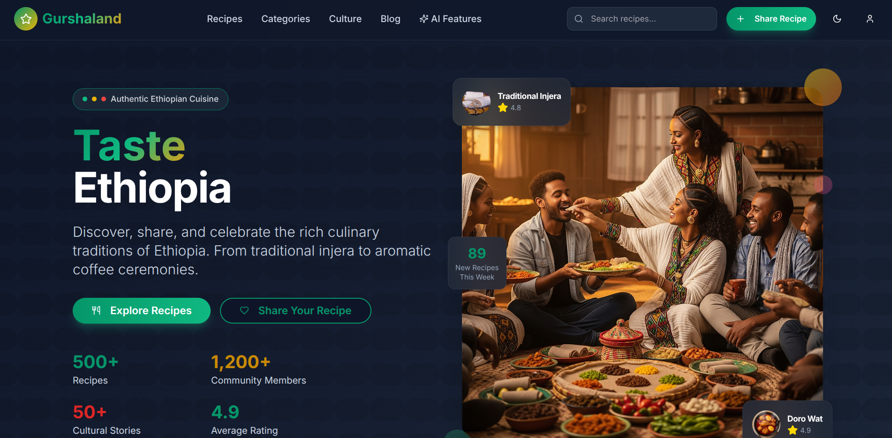

# 🥘 Gurshaland

<!--  -->

**Gurshaland** is a modern web platform for discovering, sharing, and preserving authentic Ethiopian recipes and culinary traditions. Built with Next.js, Supabase, and shadcn/ui, Gurshaland empowers the community to contribute family recipes, explore diverse dishes, and celebrate Ethiopia’s rich food heritage.

---

## ✨ Features

- **Recipe Sharing:** Submit your own recipes with images, ingredients, instructions, and cultural notes.
- **Modern UI:** Beautiful, responsive design with light/dark mode support.
- **Search & Filter:** Quickly find recipes by category, tags, or keywords.
- **Personal Accounts:** Sign up, log in, and manage your own recipe collection.
- **Favorites:** Save your favorite recipes for easy access.
- **AI-Powered:** Discover AI-generated suggestions and features (coming soon).
- **Cultural Notes:** Learn about the history and significance of each dish.

---

## 🚀 Getting Started

### 1. Clone the repository

```sh
git clone https://github.com/yourusername/gurshaland.git
cd gurshaland
```

### 2. Install dependencies

```sh
npm install
# or
yarn install
```

#### 3. Environment Variables

Create a `.env.local` file in the root of your project and add the following variables:

```env
NEXT_PUBLIC_SUPABASE_URL=your-supabase-url
NEXT_PUBLIC_SUPABASE_ANON_KEY=your-supabase-anon-key
```

Replace `your-supabase-url` and `your-supabase-anon-key` with your actual [Supabase](https://supabase.com/) project credentials.

### 4. Run the development server
```sh
npm run dev
# or
yarn dev
```


## 🛠️ Tech Stack

- **Next.js 14** – React framework for server-side rendering and routing
- **Supabase** – Authentication & database as a service
- **shadcn/ui** – Accessible, customizable UI components
- **Tailwind CSS** – Utility-first CSS framework for rapid styling
- **Zustand** – Simple, fast state management for React
- **React Hook Form + Zod** – Form handling and schema validation
- **Lucide Icons** – Beautiful, open-source icon set

## 📁 Project Structure

```
gurshaland/
├── app/         # Next.js app directory (routes, layouts, pages)
├── components/  # Reusable React components
├── constants/   # Static data and configuration
├── store/       # Zustand state stores
├── utils/       # Utility functions and TypeScript types
├── public/      # Static assets (images, icons, etc.)
├── styles/      # Global styles (CSS, Tailwind)
└── ...          # Additional files and folders
```

## 🤝 Contributing

We welcome contributions from the community!  
If you have ideas, find a bug, or want to add a new feature, please [open an issue](https://github.com/yourusername/gurshaland/issues) or submit a pull request.

---

## 📜 License

This project is licensed under the [MIT License](LICENSE).

---

## 🌍 About

**Gurshaland** is dedicated to preserving and sharing the vibrant flavors of Ethiopia.  
Share your family’s recipes, discover new favorites, and help keep culinary traditions alive!

Enjoy cooking and sharing! 🇪🇹
