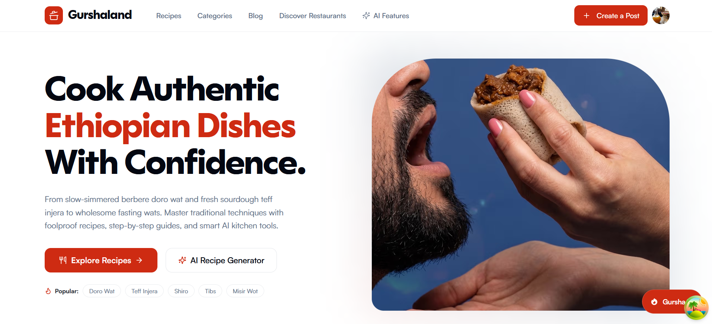

# Gurshaland

A modern platform for discovering and sharing authentic Ethiopian recipes, cultural food stories, restaurants, and AI-powered meal planning. Built with Next.js, Supabase, and shadcn/ui.



## Features

- Recipe browsing with search, category, and difficulty filters
- User accounts and saved recipe collections
- AI recipe generator that builds an Ethiopian dish from a prompt (costs credits)
- Blog with articles and tips
- Restaurant directory

## Tech Stack

- Next.js (App Router), React
- Supabase (auth, database, storage)
- Tailwind CSS, shadcn/ui
- Zustand
- React Hook Form + Zod
- Vercel AI SDK / Google Generative AI
- pnpm

## Getting Started

1. Install dependencies:

   ```sh
   pnpm install
   ```

2. Create `.env.local` with the required variables:

   ```env
   NEXT_PUBLIC_SUPABASE_URL=...
   NEXT_PUBLIC_SUPABASE_ANON_KEY=...
   NEXT_PUBLIC_URL=...
   SUPABASE_SERVICE_ROLE_KEY=...
   GOOGLE_GENERATIVE_AI_API_KEY=...
   YOUTUBE_API_KEY=...
   ```

   `POLAR_ACCESS_TOKEN`, `POLAR_WEBHOOK_SECRET`, `POLAR_PRODUCT_ID`, and `POLAR_SERVER` are optional and used for credit purchases.

3. Run the development server:

   ```sh
   pnpm dev
   ```

## Scripts

- `pnpm dev` - development server
- `pnpm build` - production build
- `pnpm start` - start production server
- `pnpm lint` - lint dashboard and dashboard components
- `pnpm lint:all` - lint everything
- `pnpm test` - run tests (vitest)

## Project Structure

```
app/         # Next.js app router (pages, layouts, routes)
components/  # React components
actions/     # Server actions
store/       # Zustand stores
hooks/       # React hooks
lib/         # Shared libraries
utils/       # Helpers and types
constants/   # Static data
ai/          # AI providers and prompts
sql/         # SQL migrations and RPC functions
supabase/    # Supabase functions and config
styles/      # Global styles
public/      # Static assets
```

## Contributing

Open an issue or submit a pull request.
